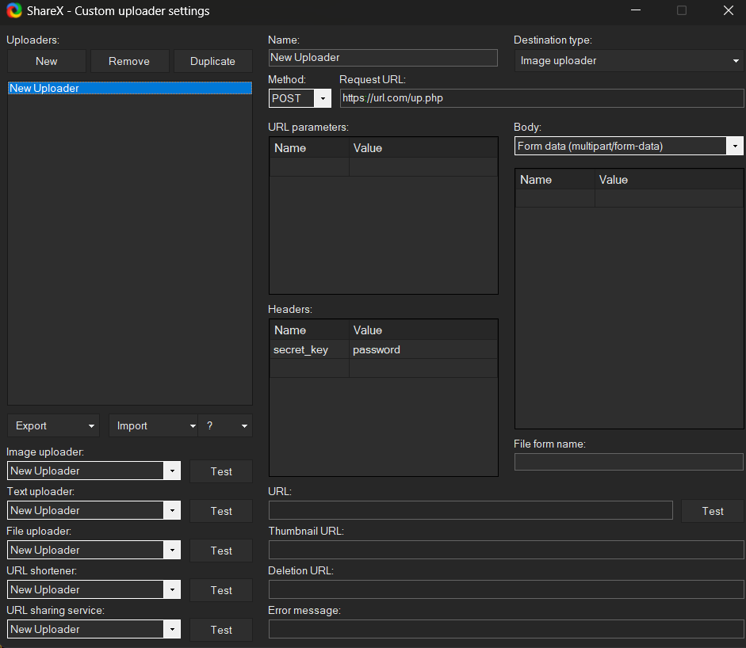

<div align="center">
<a href="README_es.md">[VERSIÓN EN ESPAÑOL]</a>
</div>

<div align="center">
 
<h3>
 Image Server 🖼️
</h3>
  <p>ShareX based image webserver</p>
</div>

<div align="center">
    <span>&nbsp;✦&nbsp;</span>
    <a href="#-getting-started">
        🚀 Getting Started
    </a>
    <span>&nbsp;✦&nbsp;</span>
    <a href="#-sharex-configuration">
        ⚙️ ShareX Configuration
    </a>
    <span>&nbsp;✦&nbsp;</span>
    <a href="#-license">
        📜 License
</div>

<div align="center"></div>

## 🚀 Getting Started


Welcome to the Image Server setup guide. This guide will help you quickly set up and configure the `up.php`, which handles secure file uploads to your server.

Before you begin, make sure your server meets the following requirements:

- **NGINX** (version X.X or higher)
- **PHP** (version X.X or higher) with support for file uploads (e.g., php-fpm)
- An **SSL certificate** (optional but recomended) if you plan to use HTTPS

### Step 1: Upload the up.php File
Start by uploading the up.php file to your web server. Place the file in the desired directory within your web root (e.g., /var/www/your-domain.com/public/).

### Step 2: Configure the Script
Open the up.php file and customize the following configuration options:

- Secret Key (`$secret_key`):
This is the password required to upload files. Set this to a strong, secure value.

Example:
```php
$secret_key = "your_strong_password";
```

- Images Directory (`$sharexdir`):
This is the directory where uploaded files will be stored. Ensure this directory exists and is writable by the web server.
Example:
```php
$sharexdir = "images/";
```

-Domain URL (`$domain_url`):
Set this to your domain name. Remember to use https:// if your site is secured with SSL.
Example:
```php
$domain_url = 'https://your-domain.com/';
```

- File Name Length (`$lengthofstring`):
This determines the length of the randomly generated file names. Adjust this value as needed.
Example:
```php
$lengthofstring = 8;
```

- Step 3: Set Directory Permissions
Make sure the directory specified in $sharexdir exists and is writable by the web server. You can set the necessary permissions using the following commands (replace /path/to/uploads with your actual directory path):

```bash
sudo mkdir -p /path/to/uploads
sudo chown -R www-data:www-data /path/to/uploads
sudo chmod -R 775 /path/to/uploads
```

- Step 4: Configure NGINX
You need to configure NGINX to serve your PHP script. Create a new server block configuration file in /etc/nginx/sites-available/. Here’s an example configuration:

```nginx
server {
    listen 80;
    server_name your-domain.com;

    root /var/www/your-domain.com/public;
    index index.php index.html;

    location / {
        try_files $uri $uri/ =404;
    }

    location ~ \.php$ {
        include snippets/fastcgi-php.conf;
        fastcgi_pass unix:/var/run/php/phpX.X-fpm.sock;
        fastcgi_param SCRIPT_FILENAME $document_root$fastcgi_script_name;
        include fastcgi_params;
    }

    location ~ /\.ht {
        deny all;
    }
}
```
Make sure to replace the paths and PHP socket version as needed. After editing, enable the site and reload NGINX:

```bash
sudo ln -s /etc/nginx/sites-available/your-domain.com /etc/nginx/sites-enabled/
sudo systemctl reload nginx
```

## ⚙️ ShareX Configuration

1. Change the Destination in `Destinations`> `Image Uploader`> Select `Custom Image uploader`
2. Go to `Destinations` > `Custom uploader settings` and create a New Uploader.



3. Fill up With a POST request and the url/up.php and add the password on headers section, as it appears on the screenshot


### 🤝 Contributing

<a href="https://github.com/n1cklim/imageserver/graphs/contributors">
  
</a>

### 📜 License


