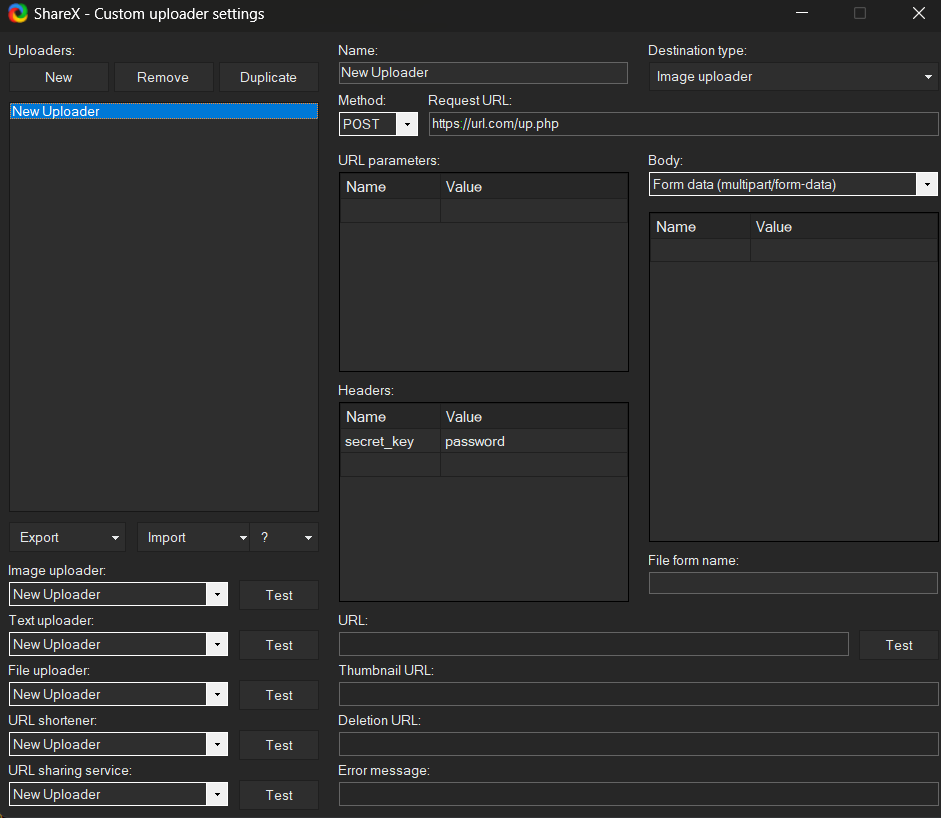

<div align="center">

<h3>
Servidor de imágenes 🖼️
</h3>
<p>Servidor web de imágenes basado en ShareX</p>
</div>

<div align="center">
<span>&nbsp;✦&nbsp;</span>
<a href="#-getting-started">
🚀 Primeros pasos
</a>
<span>&nbsp;✦&nbsp;</span>
<a href="#-sharex-configuration">
⚙️ Configuración de ShareX
</a>
<span>&nbsp;✦&nbsp;</span>
<a href="#-license">
📜 Licencia
</div>

## 🚀 Primeros pasos

Bienvenido a la guía de configuración del servidor de imágenes. Esta guía lo ayudará a configurar rápidamente `up.php`, que maneja las cargas seguras de archivos a su servidor.

Antes de comenzar, asegúrese de que su servidor cumpla con los siguientes requisitos:

- **NGINX** (versión X.X o superior)
- **PHP** (versión X.X o superior) con soporte para cargas de archivos (por ejemplo, php-fpm)
- Un **certificado SSL** (opcional pero recomendado) si planea usar HTTPS

### Paso 1: Cargue el archivo up.php
Comience cargando el archivo up.php a su servidor web. Coloque el archivo en el directorio deseado dentro de la raíz de su sitio web (por ejemplo, /var/www/your-domain.com/public/).

### Paso 2: Configure el script
Abra el archivo up.php y personalice las siguientes opciones de configuración:

- Clave secreta (`$secret_key`):
Esta es la contraseña necesaria para cargar archivos. Establezca un valor seguro y fuerte.

Ejemplo:
```php
$secret_key = "your_strong_password";
```

- Directorio de imágenes (`$sharexdir`):
Este es el directorio donde se almacenarán los archivos cargados. Asegúrese de que este directorio exista y que el servidor web pueda escribir en él.
Ejemplo:
```php
$sharexdir = "images/";
```

- URL de dominio (`$domain_url`):
Establezca este valor en su nombre de dominio. Recuerde utilizar https:// si su sitio está protegido con SSL.
Ejemplo:
```php
$domain_url = 'https://your-domain.com/';
```

- Longitud del nombre de archivo (`$lengthofstring`):
Esto determina la longitud de los nombres de archivo generados aleatoriamente. Ajuste este valor según sea necesario.
Ejemplo:
```php
$lengthofstring = 8;
```

- Paso 3: Establecer permisos de directorio
Asegúrese de que el directorio especificado en $sharexdir exista y que el servidor web pueda escribir en él. Puede establecer los permisos necesarios utilizando los siguientes comandos (reemplace /path/to/uploads con su ruta de directorio real):

```bash
sudo mkdir -p /path/to/uploads
sudo chown -R www-data:www-data /path/to/uploads
sudo chmod -R 775 /path/to/uploads
```

- Paso 4: Configurar NGINX
Debe configurar NGINX para que sirva su script PHP. Cree un nuevo archivo de configuración del bloque de servidor en /etc/nginx/sites-available/. A continuación, se incluye un ejemplo de configuración:

```nginx
server {
listen 80;
server_name your-domain.com;

root /var/www/your-domain.com/public;
index index.php index.html;

location / {
try_files $uri $uri/ =404;
}

location ~ \.php$ {
include snippets/fastcgi-php.conf;
fastcgi_pass unix:/var/run/php/phpX.X-fpm.sock;
fastcgi_param SCRIPT_FILENAME $document_root$fastcgi_script_name;
include fastcgi_params;
}

location ~ /\.ht {
deny all;
}
}
```
Asegúrese de reemplazar las rutas y la versión del socket PHP según sea necesario. Después de editar, habilite el sitio y vuelva a cargar NGINX:

```bash
sudo ln -s /etc/nginx/sites-available/your-domain.com /etc/nginx/sites-enabled/
sudo systemctl reload nginx
```

## ⚙️ Configuración de ShareX

1. Cambie el destino en `Destinos`> `Cargador de imágenes`> Seleccione `Cargador de imágenes personalizado`
2. Vaya a `Destinos`> `Configuración del cargador personalizado` y cree un nuevo cargador.



3. Completa con una solicitud POST y la url/up.php y agrega la contraseña en la sección de encabezados, como aparece en la captura de pantalla

### 🤝 Contribuyendo

<a href="https://github.com/n1cklim/imageserver/graphs/contributors">

</a>

### 📜 Licencia
